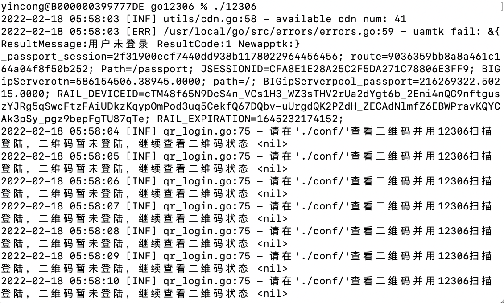
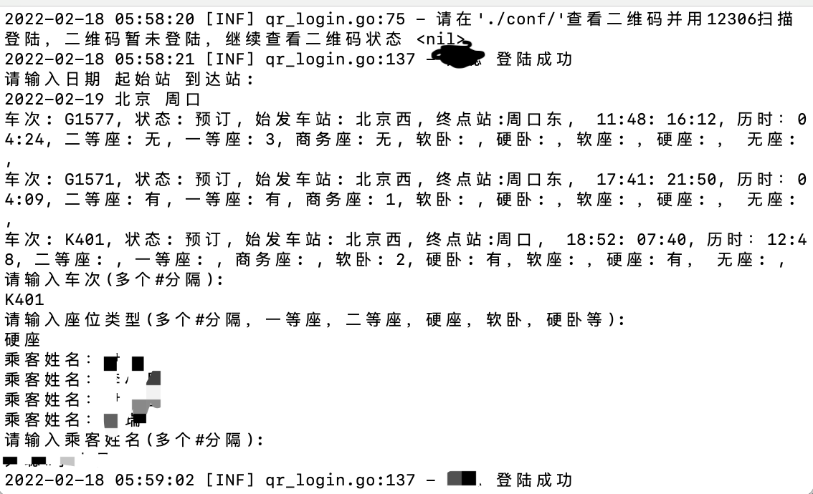
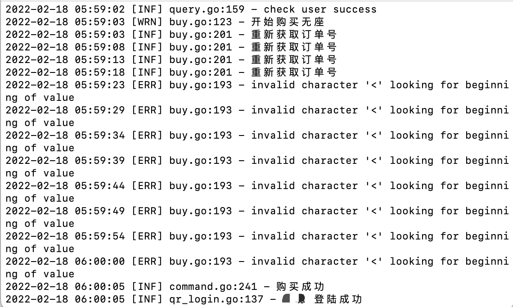

### 使用方法

```
首先二进制启动进行扫码登陆：
```



```
登陆完成后
提示
“请输入日期 起始站 到达站:”  时
填写日期，始发站，到达站
2022-02-19 xx xx

然后提示
“请输入车次(多个#分隔):” 时
输入你要买的车次，多个用#分隔
K401#G1571

最后提示
“请输入乘客姓名(多个#分隔):”时
输入乘车人
张三#李四#赵5
```


```
然后就开始轮训买票了，直到买票成功
```


### 通知
```
通知方式咱只支持企业微信机器人，请下载企业微信，
添加教程：https://www.zhihu.com/question/332661042
获取到机器人的链接后使用
./go12306 -wxrobot="https://qyapi.weixin.qq.com/cgi-bin/webhook/send?key=xxxxxxxxxxxxxxxxxxxx"
```

### feature
```
1. cdn查询车票
2. 企业微信机器人通知
3. app扫码登陆
4. 自动查询车票，下订单
```

### http接口
本人能力有限不能提供前端页面，如果有大佬想写前端，可以依赖本项目进行，本项目提供http接口  
 [接口文档](API.md)

### 可执行文件
[下载可执行文件](https://github.com/yincongcyincong/go12306/releases)


q群：550982733
